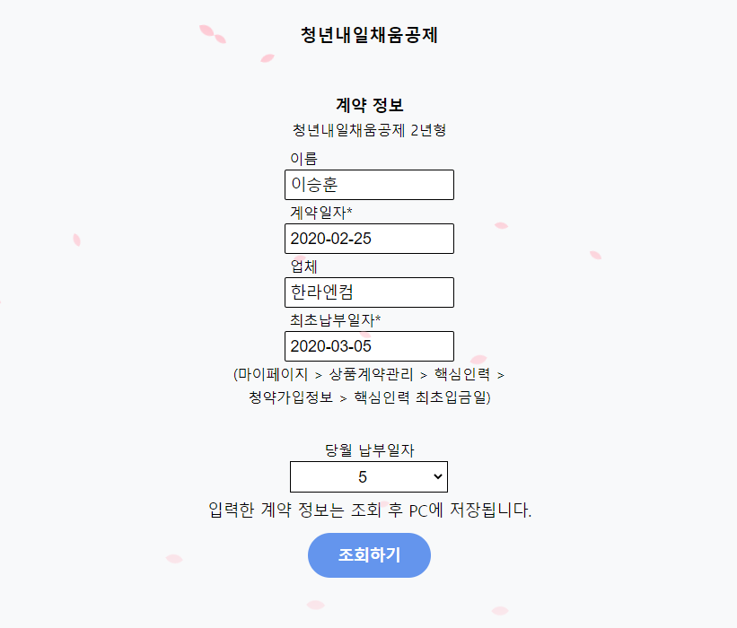
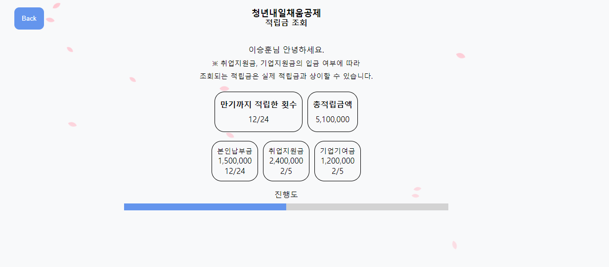

# 나의 청년내일채움공제

복잡한 로그인 없이 간단하게 자신의 계약 정보를 확인한다.  
[바로가기](https://hoondragonite.github.io/MySbcPlan/)

## 프로젝트 소개
사용자가 기입한 청년내일채움공제 계약 정보를 기반으로 지금까지 납부한 금액과 적립된 금액을 조회한다.  
단, 납부예정일에 정상적으로 금액이 납부되었다는 가정하에 조회한다.  
(현재일자가 납부예정일 당일일 경우 납부했다는 것으로 함)  

## 목표
1. LocalStorage에 대해 알아본다.
2. 진행 현황에 따른 시각적 이미지를 표현한다.
3. Mobile First 전략으로 반응형으로 화면을 구성해본다.
4. 공인인증서 로그인 없이 간단한 정보만으로 자신의 계약 정보를 조회한다.

## 포함한 기능
1. 청약기본정보 입력  
    - 이름  
    - 계약일자  
    - 업체명  
    - 최초 납부일자
    - 당월 납부일자
2. 납부금액 조회
    - 계약일자부터 현재일자까지 적립된 금액을 조회한다.

## 화면
|             홈              |           결과조회            |
| :-------------------------: | :---------------------------: |
|  |  |

## Tech Stack
### Language
HTML5  
CSS3  
Javascript  
### Library
jquery 1.7.1  
Moment.js  
Falling Sakura (https://codepen.io/parkgun/pen/dmQRaX)  
store.js  

## Issue
1. LocalStorage 크로스 브라우징  
  -> store.js 이용